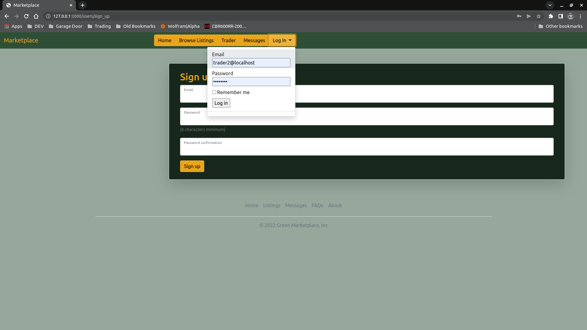

# README document

## R7 - ID the problem

Someone who has an interest if sustainable living has grown an excess of a particular crop or something they have produced and would like to avoid wasting this excess while potentially also getting something that might need in return.
While physical marketplaces exist as well as social media swap groups exists, people can be too busy to get to a physical market and social media swap groups can be fragmented, even in one city, meaning a person might have to advertise something in more than one place.

## R8 - Why does the problem need solving

With an increased focus on sustainable living and shortening food supply chains, many are turning to growing their own food where they can. However with limited space and the nature of growing food being sporadic, a single person or family in a built up area may go from an excess of one item, with food being wasted to periods with no own produced food.
By encouraging the trading of these own produced items, even on the promise of a crop not yet harvested or a return of a share of processed items means a individual or family may be able to spread their excess out to avoid wastage while also gaining produce to cover their own lull periods.
With a focus on trading/ bartering as opposed to purchasing may help to provide an lower entry barrier to participation.

## R9 - Link to the deployed project

[Application on Heroku](http://green-marketplace.herokuapp.com/)

## R10 - Link to the Repository

[Application Repository](https://github.com/Samworth27/t2a2)
[Application Project](https://github.com/users/Samworth27/projects/3/views/1)

## R11 - Description of the App

### R11a - Purpose

The applications purpose is to provide a framework to enable users to barter and trade for goods in their local area

### R11b - Functionality/ features

- Ability to create and manage listings
- Ability to browse categories for listings
- Ability to message a user about their listing

### R11c - Sitemap

### R11d - Screenshots

#### Landing Page


#### Sign Up Page


#### Login From The Nav Bar



#### Landing Page After logging In


#### Managing Your listings


#### Creating A listing


#### Categories Splash Page


#### Browsing Fresh Produce Category


#### Viewing Tomatoes Category


#### Sending A Message About A Listing


#### Conversation After Sending A Message From Listing Page


#### Receiving A Message From A Listing


#### Logged In As An Admin User


#### Modifying A Category As An Admin User


### R11e - Target Audience

- People interested in sustainable living and/or urban farming

### R11f - Tech Stack

- Ruby on Rails
  - Devise Gem for authentication
  - Pundit and Rolify Gems for Authorisation
  - Administrate Gem provides the admin dashboard
  - Ancestry Gem provides a framework for efficiently accessing ActiveRecords stored in a data tree
- Postgresql for the DBMS
- Cloudinary as a cloud image service
- Bootstrap as the CSS framework

## R12 - User Stories

### Definitions

- display: A offering of produce
- request: A request for produce
- Listing: Either a display or request

### As a Trader

- [ ] I want to be able to trade my excess produce so I can avoid wastage and get something I need for it
  - [ ] I want to be able to display my excess produce so someone else can make an offer
  - [ ] I want to be able to let other people know what items I would prefer to receive
  - [ ] I want to be able to make an offer on someone elses display
  - [ ] I want to be able to manage my displays to keep them up to date
- [ ] I want to be able to make a request for a type of item
- [ ] I want to be able to review other members to allow others to make informed choices
- [ ] I want to be able to report offensive content so I do not have to see it
- [ ] I would like to be able to know if I'm receiving a fair offer for my display
- [ ] I want to be able to leave suggestions to improve the Application
- [ ] I want to be able to save a listing

### As a Moderator

- [ ] I need to be able to view reported offensive listings , reviews and messages so I can judge if they need moderation or removal
- [ ] I need to be able to hide a listing or review until the originator rectifies the issue so others can't view it
- [ ] I need to be able to remove listings or reviews that are not compliant
- [ ] I need to be able to ban an repeatedly uncompliant user
- [ ] I want to be able to recommend to an administrator that a User deleted and blocked

### As a Admin

- [ ] I want to be able to manage items and catagories so displays can be grouped in a meaningful way
- [ ] I want to be able to manage moderators including viewing a log of their actions
- [ ] I need to be able to manage moderators requests for User deletion

### As the Owner of the App

- [ ] I want to be able to view usage statistics so I can make informed decisions on marketing
- [ ] I want to be able to lock away some features behind a pay-wall
- [ ] I need to be able to manage Admin Accounts
- [ ] I want to be able to see what people think of the Application so I can improve it

## R13 - Wireframes


## R14 - ERD


## R15 - Explain 'High Level Components' (abstractions)

- Categories
  Categories are stored in a tree graphs with each category storing a path to the root of its tree. The original implementation of these models has changed multiple times during the development process.
  Originally categories were split into two separate models, a listing would be a type of `Item` which would belong to a `Category`. Categories would also only store its parents. This implementation worked however created a large number of database queries when traversing it to create navigation menus or populate listings. While attempting to optimise the model I discovered a different method of storing the hierarchy information and an implementation using the Ruby gem `Ancestry`. This implementation uses a string to represent the path to the root and can determine relationships between records by comparing these strings. This means that you can for example select all descendants of a node with one query. After implementing this `Items` were merged into `Categories` to make use of this feature.
  Currently a listing can belong to any category however it is possible to restrict this behaviour if needed.

- Messaging system
  The messaging system for the application is built around `Conversations` which have have any number of users. When a message is sent it is sent to a conversation and any user part of that conversation can view it. Currently a conversation can only be created between two users in the Application.
  The message framework is flexible enough that a conversation could exist that any user could join, or a private group chat could exist.
  Messages can be sent with additional context to them. For example, in the application if a message is sent to a user from one of their listings, it will contain that a link to that listing as part of the message. A planned extension of this was to include an 'offer' as part of the message.

- Listings
  Currently these are bare and underdeveloped.
  On creation they are linked to a category and use a drop down menu of measurements combined with a number to allow the amount of an item being offered to be quantified and tracked. This was done to allow a trade to be compared to others like it to determine if a trade was 'fair' or not.
  Images can be attached to a listing however if one is not it will default to the image of the category it belongs to.

- Admin Dashboard
  The framework for the admin dashboard is provided by the Ruby gem `Administrate` however has been extensively modified to blend with the rest of the application.
  The admin dashboard is recreated with reduced scope for the management of a users listings.

- Users and Profiles
  User account information is stored separately from the profile information. This is mainly to create a separation of information between what is needed for authentication and authorisation and the profile information itself. A positive side effect of this is profile information is only ever called when explicitly needed. The amount of times the profile record needs to be requested could be reduced by caching the value of the users preferred display name in the user model and updating this value when the profile is modified. While this would mean that database is not completely normalized it could offer a performance improvement if the single value was being called often enough.

## R16 - Detail 3rd party services

### Heroku

The application is being hosted on Heroku to take advantage of the Heroku CLI. This means that the cloud application can be controlled through an authorised terminal through rake tasks, this includes database migrations and seeding most importantly.

### Cloudinary

Cloudinary is used to provide cloud image hosting functionality for the application. This is required as Heroku resets the uploaded repository every 24 hours therefore deleting any uploaded files.
The Cloudinary API is accessed through the Cloudinary gem.

## R17 - Describe 'model' relationships


### The User

#### User Roles

```ruby
has_many :users_role
has_many :roles, through: :users_role
```

Using the 'Rolify' Gem, a User can have many roles through the users_role table.

#### User Profiles

```ruby
has_one :profile
```

The decision was made to separate a User account from their profile. This was done to simply making changes to the way users are managed without destroying information regarding a profile. It also means profile information is not called when not required, eg, for authentication purposes.

#### User Conversations and Messages

```ruby
has_many :user_conversations
has_many :conversations, through: :user_conversations
has_many :messages
```

A User can have many Conversations however there can only be one Conversation between any two Users.
A User can have many Messages however a message can only have one User as its Sender.

### Listings

#### Its Category

```ruby
  belongs_to :category
```

The category the listing falls under. Can only have one category currently.

#### Its Owner

```ruby
  belongs_to :owner, class_name: 'User', foreign_key: 'user_id'
```

The user who created the listing, a listing can only have one owner.

#### Measurement System

```ruby
  belongs_to :measurement
```

A system to classify the units of measurement was created to allow the quantification of trades. A listing can have only one measurement.

#### Messages

```ruby
has_many :messages
```

When a message is sent from a listing's page this information is stored in the Message record. A listing can have many associated messages.

#### Attachments

```ruby
  has_one_attached :image
```

A listing can have a single image attached for display purposes.

### Conversations

```ruby
  has_many :user_conversations
  has_many :users, through: :user_conversations
  has_many :messages
```

The messaging system was built to be robust and allow for future development. A user is joined to a conversation though the user_conversations join table. This allows a conversation to have more than 2 users, although the current implementation only allows for one conversation between two users and only two users to a conversation.
Possible extensions of this would include a bulletin board, or group messaging system, commenting on listings or profiles, etc. 
A user can have many messages and this is recorded through a primary key field in the message record.

### Categories

```ruby
  has_one_attached :image

```

A Category can have one image attached for display purposes.

```ruby
  has_many :listings
```

A Category can have many listings associated with it, this is to enable selection of many listings by Category. 

#### Category Ancestry

A Category can have have a single Parent and many Children. This relationship forms a graph tree of Categories and also allows for other relationships to be derived such as Siblings, Ancestors, Descendants and any related (belonging to the same tree).
If a Category does not have a Parent then it forms the root node for its own tree.

## R18 - Discuss database relations


### Users

A user can have only one profile, however can have many roles, conversations, messages and listings.
Because a roles and conversations can also belong to many users, join tables are used for these associations.
The associations for the messages, listings and profiles are stored as Foreign Key of the User ID in the relevant table.

- 1-1 Profile
- 1-m UserRoles
- 1-m UserConversations
- 1-m Messages
- 1-m Listings

### Profiles

A profile can only belong to a single user
The association is stored as a Foreign Key of the User ID in this table.

- 1-1 User

### Roles

Roles can belong to many users. Because many users can have the same role the association is stored in a join table.

- 1-m UserRoles

### Conversations

Conversations can have many users and messages.
Because many users can belong to the same conversation and a single user can belong to many conversations a join table is used to store the association.

Because a message can only belong to one conversation, the association is stored as a Foreign Key of the conversation in the message table.

- 1-m UserConversations
- 1-m Messages

### Messages

A message can only belong to a single user and conversation and optionally a listing. The associations are stored with the Foreign Key of the relevant record's ID in this table.

- 1-1 Users
- 1-1 Listings (optional)
- 1-1 Conversations

### Listings

A listing can only belong to a single category and user and can only have one attachment and measurement.
The associations for categories, users and measurements are stored as the Foreign Key of the relevant record's ID in this table.
The association with attachments are stored with a join table to allow for polymorphic associations.

- 1-1 Categories
- 1-1 Users
- 1-1 ActiveStorageAttachments
- 1-1 Measurements

### Categories

A category can have many listings and only one attachment.
The associations with listings are stored as a Foreign key of the category ID in the listings table.
The association with attachments are stored with a join table to allow for polymorphic associations.

- 1-m Listings
- 1-1 ActiveStorageAttachments

### Measurements

A measurement can belong to many listings. The association is stored as the foreign key of the measurement ID in the listings table.

- 1-m Listings

### ActiveStorageAttachments

Acts as a polymorphic join table between ActiveStorageBlobs and Listings or Categories

- 1-1 Polymorphic with either Listings or Categories
- 1-1 ActiveStorageBlobs

### Other Join Tables

- UserRoles
- UserConversations
  


## R19 - Provide database schema design

```ruby
# This file is auto-generated from the current state of the database. Instead
# of editing this file, please use the migrations feature of Active Record to
# incrementally modify your database, and then regenerate this schema definition.
#
# This file is the source Rails uses to define your schema when running `bin/rails
# db:schema:load`. When creating a new database, `bin/rails db:schema:load` tends to
# be faster and is potentially less error prone than running all of your
# migrations from scratch. Old migrations may fail to apply correctly if those
# migrations use external dependencies or application code.
#
# It's strongly recommended that you check this file into your version control system.

ActiveRecord::Schema[7.0].define(version: 2022_05_19_091934) do
  # These are extensions that must be enabled in order to support this database
  enable_extension "plpgsql"

  create_table "active_storage_attachments", force: :cascade do |t|
    t.string "name", null: false
    t.string "record_type", null: false
    t.bigint "record_id", null: false
    t.bigint "blob_id", null: false
    t.datetime "created_at", null: false
    t.index ["blob_id"], name: "index_active_storage_attachments_on_blob_id"
    t.index ["record_type", "record_id", "name", "blob_id"], name: "index_active_storage_attachments_uniqueness", unique: true
  end

  create_table "active_storage_blobs", force: :cascade do |t|
    t.string "key", null: false
    t.string "filename", null: false
    t.string "content_type"
    t.text "metadata"
    t.string "service_name", null: false
    t.bigint "byte_size", null: false
    t.string "checksum"
    t.datetime "created_at", null: false
    t.index ["key"], name: "index_active_storage_blobs_on_key", unique: true
  end

  create_table "active_storage_variant_records", force: :cascade do |t|
    t.bigint "blob_id", null: false
    t.string "variation_digest", null: false
    t.index ["blob_id", "variation_digest"], name: "index_active_storage_variant_records_uniqueness", unique: true
  end

  create_table "categories", force: :cascade do |t|
    t.string "name"
    t.datetime "created_at", null: false
    t.datetime "updated_at", null: false
    t.string "slug"
    t.string "ancestry"
    t.string "plural"
    t.index ["ancestry"], name: "index_categories_on_ancestry"
    t.index ["slug"], name: "index_categories_on_slug", unique: true
  end

  create_table "conversations", force: :cascade do |t|
    t.datetime "created_at", null: false
    t.datetime "updated_at", null: false
  end

  create_table "friendly_id_slugs", force: :cascade do |t|
    t.string "slug", null: false
    t.integer "sluggable_id", null: false
    t.string "sluggable_type", limit: 50
    t.string "scope"
    t.datetime "created_at"
    t.index ["slug", "sluggable_type", "scope"], name: "index_friendly_id_slugs_on_slug_and_sluggable_type_and_scope", unique: true
    t.index ["slug", "sluggable_type"], name: "index_friendly_id_slugs_on_slug_and_sluggable_type"
    t.index ["sluggable_type", "sluggable_id"], name: "index_friendly_id_slugs_on_sluggable_type_and_sluggable_id"
  end
  
  create_table "listings", force: :cascade do |t|
    t.bigint "category_id", null: false
    t.bigint "user_id", null: false
    t.float "quantity"
    t.bigint "measurement_id", null: false
    t.date "start_dtg"
    t.date "finish_dtg"
    t.datetime "created_at", null: false
    t.datetime "updated_at", null: false
    t.string "headline"
    t.index ["category_id"], name: "index_listings_on_category_id"
    t.index ["measurement_id"], name: "index_listings_on_measurement_id"
    t.index ["user_id"], name: "index_listings_on_user_id"
  end

  create_table "measurements", force: :cascade do |t|
    t.string "unit"
    t.string "plural"
    t.string "abbreviation"
    t.string "measurement_for"
    t.string "prefix"
    t.integer "power"
    t.datetime "created_at", null: false
    t.datetime "updated_at", null: false
  end

  create_table "messages", force: :cascade do |t|
    t.bigint "user_id", null: false
    t.bigint "conversation_id", null: false
    t.datetime "created_at", null: false
    t.datetime "updated_at", null: false
    t.text "body"
    t.bigint "listing_id"
    t.index ["conversation_id"], name: "index_messages_on_conversation_id"
    t.index ["listing_id"], name: "index_messages_on_listing_id"
    t.index ["user_id"], name: "index_messages_on_user_id"
  end

  create_table "profiles", force: :cascade do |t|
    t.string "display_name"
    t.string "first_name"
    t.string "last_name"
    t.string "country"
    t.string "state"
    t.string "suburb"
    t.datetime "created_at", null: false
    t.datetime "updated_at", null: false
    t.bigint "user_id", null: false
    t.index ["user_id"], name: "index_profiles_on_user_id"
  end

  create_table "roles", force: :cascade do |t|
    t.string "name"
    t.string "resource_type"
    t.bigint "resource_id"
    t.datetime "created_at", null: false
    t.datetime "updated_at", null: false
    t.index ["name", "resource_type", "resource_id"], name: "index_roles_on_name_and_resource_type_and_resource_id"
    t.index ["resource_type", "resource_id"], name: "index_roles_on_resource"
  end

  create_table "user_conversations", force: :cascade do |t|
    t.bigint "user_id", null: false
    t.bigint "conversation_id", null: false
    t.datetime "created_at", null: false
    t.datetime "updated_at", null: false
    t.index ["conversation_id"], name: "index_user_conversations_on_conversation_id"
    t.index ["user_id", "conversation_id"], name: "index_user_conversations_on_user_id_and_conversation_id", unique: true
    t.index ["user_id"], name: "index_user_conversations_on_user_id"
  end

  create_table "users", force: :cascade do |t|
    t.string "email", default: "", null: false
    t.string "encrypted_password", default: "", null: false
    t.string "reset_password_token"
    t.datetime "reset_password_sent_at"
    t.datetime "remember_created_at"
    t.integer "sign_in_count", default: 0, null: false
    t.datetime "current_sign_in_at"
    t.datetime "last_sign_in_at"
    t.string "current_sign_in_ip"
    t.string "last_sign_in_ip"
    t.string "confirmation_token"
    t.datetime "confirmed_at"
    t.datetime "confirmation_sent_at"
    t.string "unconfirmed_email"
    t.datetime "created_at", null: false
    t.datetime "updated_at", null: false
    t.index ["confirmation_token"], name: "index_users_on_confirmation_token", unique: true
    t.index ["email"], name: "index_users_on_email", unique: true
    t.index ["reset_password_token"], name: "index_users_on_reset_password_token", unique: true
  end

  create_table "users_roles", id: false, force: :cascade do |t|
    t.bigint "user_id"
    t.bigint "role_id"
    t.index ["role_id"], name: "index_users_roles_on_role_id"
    t.index ["user_id", "role_id"], name: "index_users_roles_on_user_id_and_role_id"
    t.index ["user_id"], name: "index_users_roles_on_user_id"
  end

  add_foreign_key "active_storage_attachments", "active_storage_blobs", column: "blob_id"
  add_foreign_key "active_storage_variant_records", "active_storage_blobs", column: "blob_id"
  add_foreign_key "listings", "categories"
  add_foreign_key "listings", "measurements"
  add_foreign_key "listings", "users"
  add_foreign_key "messages", "conversations"
  add_foreign_key "messages", "listings"
  add_foreign_key "messages", "users"
  add_foreign_key "profiles", "users"
  add_foreign_key "user_conversations", "conversations"
  add_foreign_key "user_conversations", "users"
end

```

## R20 - Describe the way tasks are allocated and tracked in the project

Github projects was used to manage tasks (including allocation and tracking) in the project as it directly integrates with the Github repository while still providing ability to use kanban boards if wanted.

- [ ] Tasks are created in the project, and are converted into issues for the repository.
  - [ ] Larger tasks are then broken down into smaller tasks which are then have their own issues raised in the repository.
    - [ ] This is repeated until the tasks are small and easily defined.
    - [x] The sub tasks are tracked in the parent issue using markdown checkboxes and a link to the child tasks.
  - [ ] Github handles all of the links and updating of checkboxes in house. For example - [ ] #1 would be converted into:
  - [ ] [<svg style="fill:green" title="Open" viewBox="0 0 16 16" version="1.1" width="16" height="16" aria-hidden="true"><path d="M8 9.5a1.5 1.5 0 100-3 1.5 1.5 0 000 3z"></path><path fill-rule="evenodd" d="M8 0a8 8 0 100 16A8 8 0 008 0zM1.5 8a6.5 6.5 0 1113 0 6.5 6.5 0 01-13 0z"></path></svg> #1 Trader Stories ](https://github.com/Samworth27/T2A2/issues/1)
  - [ ] while a closed issue would look like:
  - [x] [<svg style="fill:purple" title="Open" viewBox="0 0 16 16" version="1.1" width="16" height="16" aria-hidden="true"><path d="M8 9.5a1.5 1.5 0 100-3 1.5 1.5 0 000 3z"></path><path fill-rule="evenodd" d="M8 0a8 8 0 100 16A8 8 0 008 0zM1.5 8a6.5 6.5 0 1113 0 6.5 6.5 0 01-13 0z"></path></svg> #1 Make Offers ](https://github.com/Samworth27/T2A2/issues/5)

Tasks are allocated by assigning a Github member to a task. For this project I was the only person so all tasks were allocated to myself regardless of the status on the project application.


[Application Project](https://github.com/users/Samworth27/projects/3/views/1)
